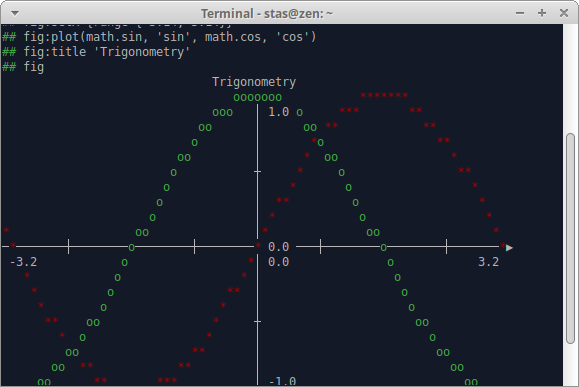

# so/\\/ata

**Sonata** is a mathematical library and console based interpreter for solving different problems. The program is written in pure **Lua** language and can be called on each platform where the **Lua** is installed. It is designed to be a handy tool for simple calculations and modeling.

## Features

* Pure Lua code (high portability)
* Variety of modules
* Template generation for new modules and localization files
* Standalone mathematical [library](./about/help.md)

## Getting started

To run the **Sonata** clone the code and call

    lua sonata.lua

To get a brief introduction, call

    lua sonata.lua notes/intro.note

Use flag _-h_ to see additional options:

    lua sonata.lua -h

## Structure 

Main components:
* _core_ - interpreter, help and test systems, other program specific elements
* _matlib_ - collection of mathematical modules 
* _sonata.lua_ - program configuration and loading

Additional components:
* _about_ - system info
* _locale_ - localization files
* _notes_ - predefined interactive files

## Dependencies 

**Sonata** works in **Lua 5.x** interpreter, version 5.3+ is preferable.

Module dependencies:
* _gnuplot.lua_ requires [gnuplot](http://www.gnuplot.info/) program to be installed
* _graph.lua_ uses [graphviz](https://graphviz.org/) for image generation

